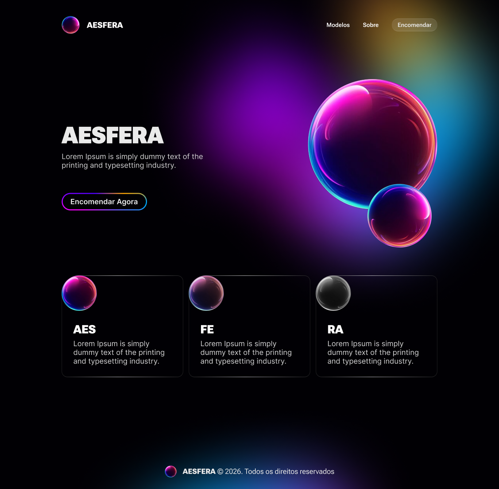

# AESFERA – Figma to Code Landing Page

This project is a frontend study exercise where a landing page layout created in Figma was recreated using HTML, CSS, and JavaScript.

The purpose of this project is to practice converting a visual design into a fully functional web page while improving frontend development skills.

## 🌐 Live Preview

https://LipeMonteiro.github.io/aesfera_landing_page

## 📷 Layout Preview

## 📚 Project Type

Academic / Study Project

The layout used in this project was recreated by following a YouTube tutorial and is intended for learning purposes only.

## 🚀 Technologies Used

- HTML5
- CSS3
- JavaScript
- Figma

## 🎯 Learning Goals

- Practice converting Figma layouts into real code
- Improve semantic HTML structure
- Develop CSS layout and styling skills
- Implement visual effects and UI components

## 📌 Project Status

Completed as a frontend learning project.
